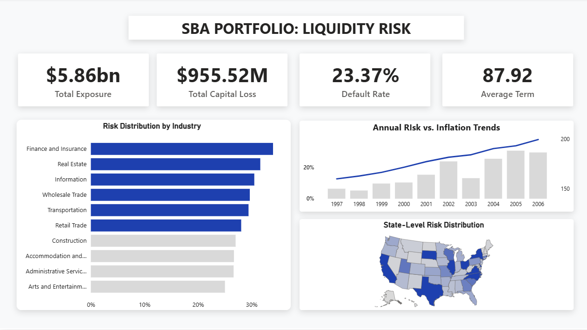

# Institutional Liquidity Risk Pipeline (SBA)

## 📌 Business Context
Mitigating capital loss from loan defaults is a primary mandate for risk officers. When institutions default, the resulting loss of principal and projected interest directly impacts bottom-line liquidity. 

This repository houses an end-to-end data engineering and machine learning architecture designed to model the risk status of Small Business Administration (SBA) clients. To ensure robust predictive power, historical client default data is dynamically joined with macroeconomic inflation trends sourced directly from the Federal Reserve Economic Data (FRED) API.

## ⚙️ System & Engineering Architecture
To simulate strict enterprise security and memory constraints, this project utilizes a **Zero-Disk Architecture**. No raw data is saved to local hard drives during ingestion.

* **Zero-Disk Data Ingestion:** Automated extraction of historical SBA data (via Kaggle API) and FRED inflation metrics. The data is processed entirely in RAM using in-memory binary streaming (`io.BytesIO` and `zipfile`) and pushed directly to the cloud via Python and SQLAlchemy.
* **Cloud Data Warehouse (Supabase):** Engineered a highly normalized SQL schema to securely house the SBA and FRED datasets. 
* **Flattened SQL Views:** Executed server-side transformations and data cleaning natively in Supabase. Developed flattened, optimized SQL views specifically tailored to feed the machine learning models and the BI dashboard.
* **UI Skeleton & Dashboard (Power BI):** Designed a strict, structured UI background logic utilizing a minimalist visual hierarchy. Power BI connects directly to the Supabase SQL views, ensuring real-time data integrity and accurate type-casting before stakeholder presentation.

## 📊 Key Insights & Business Value
The machine learning analysis and subsequent visualization revealed critical risk vectors for institutional monitoring:

* **Predictive Geographic Vectors:** Machine learning feature importance identified `Bank State` as the most highly predictive variable for default probability. Virginia leads in the highest rate of defaults, while California represents the largest volume of absolute capital loss.
* **Critical Industry Thresholds:** Applied a strict 27% default threshold to the model. Six of the top ten analyzed industries breached this critical risk zone, with heavy concentration in Finance & Insurance, Real Estate, and Information sectors.
* **Macroeconomic Risk Correlation:** The dashboard overlay of default rates against FRED data highlights a strong positive correlation: periods of elevated inflation directly precede a higher probability of client default (with an isolated historical exception noted in 2003).